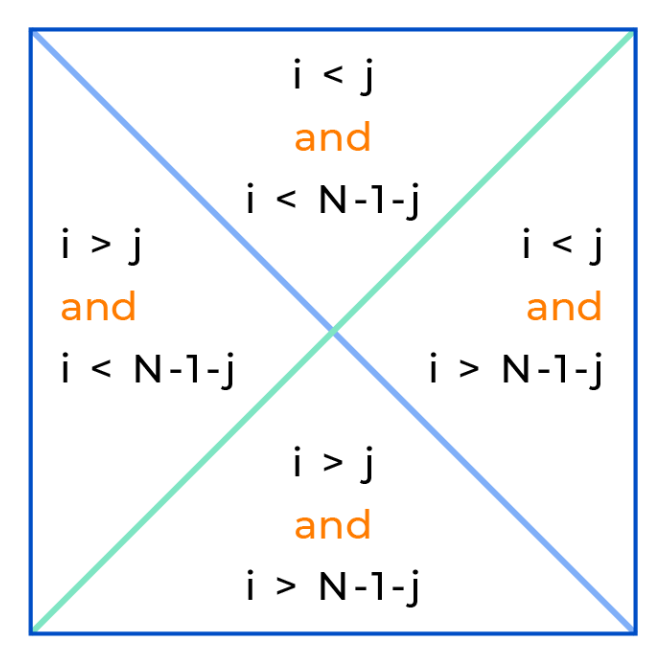

# Матрицы

## Содержание

- [Что это](#что-это)
- [Создание](#создание)
- [Считывание из ввода](#считывание-из-ввода)
- [Перебор](#перебор)
- [Диагонали](#диагонали)
- [Условия выше/ниже](#условия-вышениже)
- [Области между диагоналями](#области-между-диагоналями)
- [След матрицы](#след-матрицы)
- [ljust / rjust](#ljust--rjust)
- [Полезные приемы](#полезные-приемы)

## Что это

Матрица - таблица, состоящая из строк и столбцов, заполненная какими-то значениями. В Python представлена в виде вложенных списков.

Квадратная матрица - матрица, у которой количество строк и столбцов совпадает.

## Создание

`[[0]*n for _ in range(n)]` Создаем матрицу из n на n нулей. Каждая строка - отдельный список.

### Ловушка

`[[0]*n] * n` является ловушкой, потому что все вложенные списки - ссылки на один объект. Поэтому при изменении одного элемента меняются все - ведь это один список.

## Считывание из ввода

```python
n = int(input())
matrix = []
for _ in range(n):
    row = [int(num) for num in input().split()]
    matrix.append(row)
```
Пример:

```
Ввод:
3
1 2 3
4 5 6
7 8 9
```

Результат: `matrix = [[1, 2, 3], [4, 5, 6], [7, 8, 9]]`

`n = int(input())` - сколько строк.

`matrix = []` - пустая матрица.

Цикл `n` раз - по одной строке.

`input().split()` - разбить строку на части.

`[int(num) for num in ...]` - каждую часть в число.

`matrix.append(row)` - добавить строку.

### Почему `append`, а не `extend`

`append` - добавляет строку целиком (вложенный список)

```python
matrix = []
matrix.append([1, 2, 3])
matrix.append([4, 5, 6])
# matrix = [[1, 2, 3], [4, 5, 6]]
```

`extend` - развернул бы элементы - получился бы плоский список.

```python
matrix = []
matrix.extend([1, 2, 3])
matrix.extend([4, 5, 6])
# matrix = [1, 2, 3, 4, 5, 6]
```

### Полезно

Вариация для строк (не чисел). Без `int()` — когда нужны строки, а не числа:

```python
row = input().split() 
```

Например, когда вводятся слова (задача "Вывести матрицу 1").

## Перебор

Перебор элементов матрицы может осуществляться **по строкам** и **по столбцам**. 

### Перебор элементов матрицы по строкам

```python
for r in range(rows):
    for c in range(cols):
        print(matrix[r][c], end=' ')
    print()
```
Пример:
```
1 2 3
4 5 6
7 8 9
```

#### Как работает

Внешний цикл `for r in range(rows)` перебирает строки по одной. Каждая его итерация - очередная строка матрицы. 

Внутренний цикл `for c in range(cols)` пробегает по элементам внутри этой строки. От нулевого столбца до последнего. 

#### Про `end=' '`

`print` по умолчанию переносит строку после каждого вывода. А нам нужно - числа в одну строку через пробел, поэтому заменяем перенос на пробел с помощью `end=' '`

#### Про `print()`

`print()` после внутреннего нужен, так как он завершает текущую строку и переводит на новую. Без него все было бы в одну строку.

Выводится построчно, потому что внешний цикл = строки. Одна итерация = одна строка вывода.

### Перебор элементов матрицы по столбцам

```python
for c in range(cols):
    for r in range(rows):
        print(matrix[r][c], end=' ')
    print()
```
Пример:
```
1 4 7
2 5 8
3 6 9
```

#### Что меняется

Меняются местами циклы: внешний теперь по столбцам (`c`), внутренний по строкам (`r`).

#### Почему

Внешний цикл определяет, что выводится в одной строке. Раньше снаружи был `r` -> выводилась строка. Теперь снаружи `c` -> выводится столбец.

#### Что остается

`matrix[r][c]` - не меняется. Индексы те же. Меняется только порядок итераций.

### Транспонирование

Транспонирование - поворот матрицы, при котором строки становятся столбцами, а столбцы - строками. 

#### Что происходит

Элемент с координатами `(i, j)` переезжает на `(j, i)`.

Матрица 3 на 3: 

```
1 2 3        1 4 7 
4 5 6   ->   2 5 8 
7 8 9        3 6 9
```

#### Что изменилось

Строка 0 `(1 2 3)` стала столбцом 0 `(1 4 7)`

Строка 1 `(4 5 6)` стала столбцом 1 `(2 5 8)`

Строка 2 `(7 8 9)` стала столбцом 2 `(3 6 9)` 

#### Как в коде

Вариант А - новая матрица:

```python
transposed = []
for j in range(n):
    row = []
    for i in range(n):
        row.append(matrix[i][j])
    transposed.append(row)
```
Внешний цикл - по столбцам `j`, внутренний - по строкам `i`. Собираем новые строки из старых столбцов.

Вариант Б - через comprehension:

```python
transposed = [[matrix[i][j] for i in range(n)] for j in range(n)]
```

#### Транспонирование vs обход по столбцам

Это разное.

Обход по столбцам - выводим элементы в другом порядке, но матрица остается такой же.

Транспонирование - создаем новую матрицу, где строки и столбцы поменялись местами. Исходная не меняется (если не перезаписать).

Пример:

Обход по столбцам - вывод меняется, но исходная матрица та же.

Транспонирование - новая матрица, где строки и столбцы поменялись.

## Диагонали

### Главная диагональ

У квадратной матрицы есть две диагонали. Главная диагональ проходит из верхнего левого в правый нижний угол матрицы.

Элементы с равными индексами `i == j` находятся на главной диагонали. 

Они обозначаются `matrix[i][i]`.

Возьмем такую матрицу: 

```
1 2 3
4 5 6
7 8 9
```

На главной диагонали элементы `1, 5, 9`. 

#### Обход через цикл

Нужен 1 цикл, потому что i == j (то есть один индекс). 

```python
diag = []
for i in range(n):
    diag.append(matrix[i][i])
```

### Побочная диагональ

Побочная диагональ проходит из нижнего левого в верхний правый угол матрицы.

Элементы с индексами `i` и `j`, связанными соотношением `i + j + 1 = n` (или `j = n - 1 - i`), где `n` - размерность матрицы, находятся на **побочной диагонали**.

Элементы обозначаются `matrix[i][n - 1 - i]`.

Для примера возьмем ту же матрицу:

```
1 2 3
4 5 6
7 8 9
```

На побочной диагонали находятся элементы `3, 5, 7`.

`5` общий элемент обеих диагоналей (для нечетного `n`).

#### Обход через цикл

Нужен 1 цикл, так как `j` вычисляется из `i`. 

```python
diag = []
for i in range(n):
    diag.append(matrix[i][n - 1 - i])
```

## Условия выше/ниже

| Что | Условие |
|-----|---------|
| На главной | `i == j` |
| Выше главной | `i < j` |
| Ниже главной | `i > j` |
| На побочной | `i + j == n - 1` |
| Выше побочной | `i + j < n - 1` |
| Ниже побочной | `i + j > n - 1` |

Главная - через разницу `i` и `j`. Побочная - через сумму `i + j`. 

ЕСЛИ СОВСЕМ НЕ ПОНЯЛ: 

Главная — когда индексы равны (i == j). Побочная — когда сумма индексов постоянна (i + j == n-1).

## Области между диагоналями



Матрица делится двумя диагоналями на четыре области: верхнюю, правую, нижнюю и левую.

| Область | Без диагоналей | С диагоналями |
|---------|----------------|----------------|
| Верхняя | `i < j` и `i + j < n-1` | `i <= j` и `i + j <= n-1` |
| Правая | `i < j` и `i + j > n-1` | `i <= j` и `i + j >= n-1` |
| Нижняя | `i > j` и `i + j > n-1` | `i >= j` и `i + j >= n-1` |
| Левая | `i > j` и `i + j < n-1` | `i >= j` и `i + j <= n-1` |

Для нечётного `n` диагонали пересекаются в центре. Если включать обе — центральная клетка попадёт сразу во все четыре области.

## След матрицы

След — сумма элементов главной диагонали. Определён только для квадратной матрицы.

Формула: `tr(A) = matrix[0][0] + matrix[1][1] + ... + matrix[n-1][n-1].`

### Как найти в коде

Один цикл. Потому что i == j.

```python
total = 0
for i in range(n):
    total += matrix[i][i]
```    
Пример. 

```
1 2 3
4 5 6
7 8 9
```
След = `1 + 5 + 9 = 15`

## ljust / rjust

Эти два метода добавляют пробелы - `ljust` справа, `rjust` слева. До заданной ширины.

`width` — целевая ширина строки:

Строка короче width → добавятся пробелы.

Строка длиннее или равна width → не меняется.

Строка уже — обрезки нет.

Пример:

```
'5'.rjust(5) # '    5' — пробелы слева
'5'.ljust(5) # '5    ' — пробелы справа
```

С `rjust` пробелы перед `5`. С `ljust` пробелы после `5`.

### Когда применять

Когда числа разной длины - столбцы имеют тенденцию плясать. `rjust` выравнивает - разряды совпадают.

### Важно

`ljust / rjust` - методы строк. Число сначала нужно перевести в строку:

```python
str(matrix[r][c]).rjust(width)
```
Без `str` - ошибка.

### Пример вывода

До: 
```
277 -930 11 0
9 43 6 87
```

После: 
```
  277  -930    11     0
    9    43     6    87
```

## Полезные приемы

### `sum(row)`

Короткий способ суммы строки.

```python 
total = 0
for row in matrix:
    total += sum(row)
```
`sum(row)` заменяет внутренний цикл - не нужно перебирать элементы строки вручную.

### `print_matrix`

Готовый шаблон вывода:

```python
def print_matrix(matrix, n, width=1):
    for r in range(n):
        for c in range(n):
            print(str(matrix[r][c]).ljust(width), end=' ')
        print()
```            
`print_matrix` - только для квадратной матрицы (так как принимает только `n`).